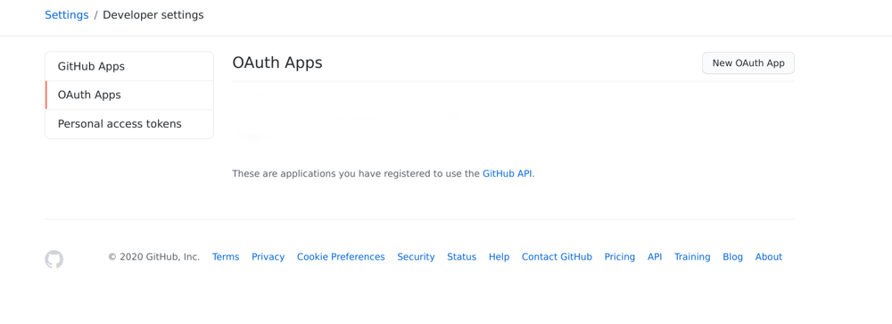
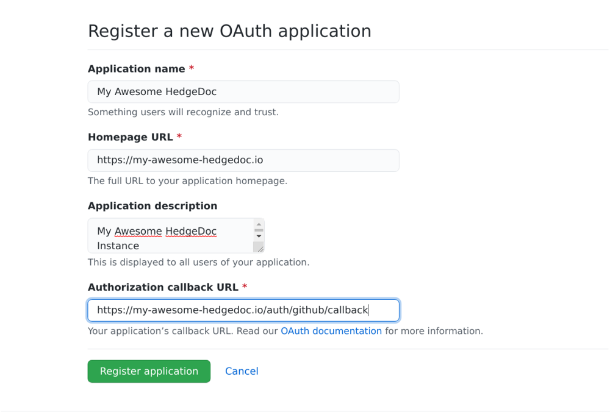
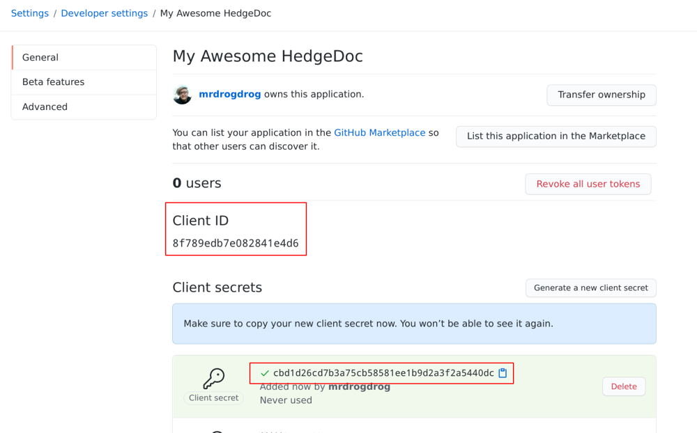

# Authentication guide - GitHub

1. Sign-in or sign-up for a GitHub account

2. Navigate to developer settings in your GitHub account [here](https://github.com/settings/developers) and select the "OAuth Apps" tab

3. Click on the **New OAuth App** button, to create a new OAuth App:  
   

4. Fill out the new OAuth application registration form, and click **Register Application**  
   

   **Note:** *The callback URL is <your-hedgedoc-url>/auth/github/callback*

5. After successfully registering the application, you'll receive the Client ID and Client Secret for the application  
   

6. Add the Client ID and Client Secret to your config.json file or pass them as environment variables
  - `config.json`:
    ```js
    {
      "production": {
        "github": {
          "clientID": "3747d30eaccXXXXXXXXX",
          "clientSecret": "2a8e682948eee0c580XXXXXXXXXXXXXXXXXXXXXX"
        }
      }
    }
    ```

  - environment variables:
    ```sh
    CMD_GITHUB_CLIENTID=3747d30eaccXXXXXXXXX
    CMD_GITHUB_CLIENTSECRET=2a8e682948eee0c580XXXXXXXXXXXXXXXXXXXXXX
    ````
